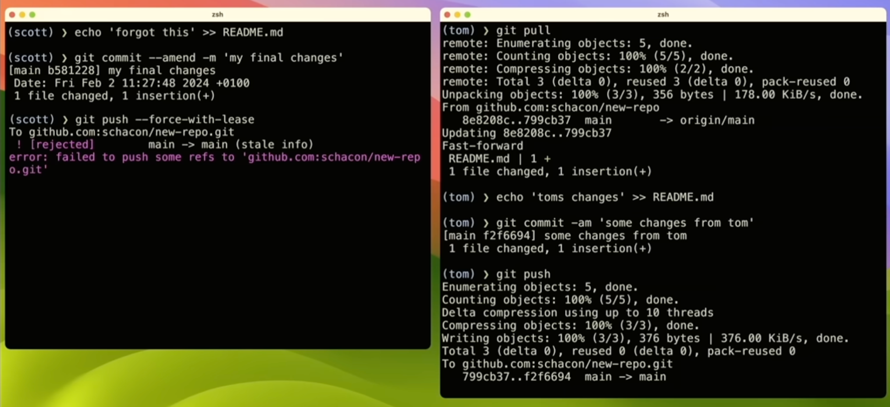
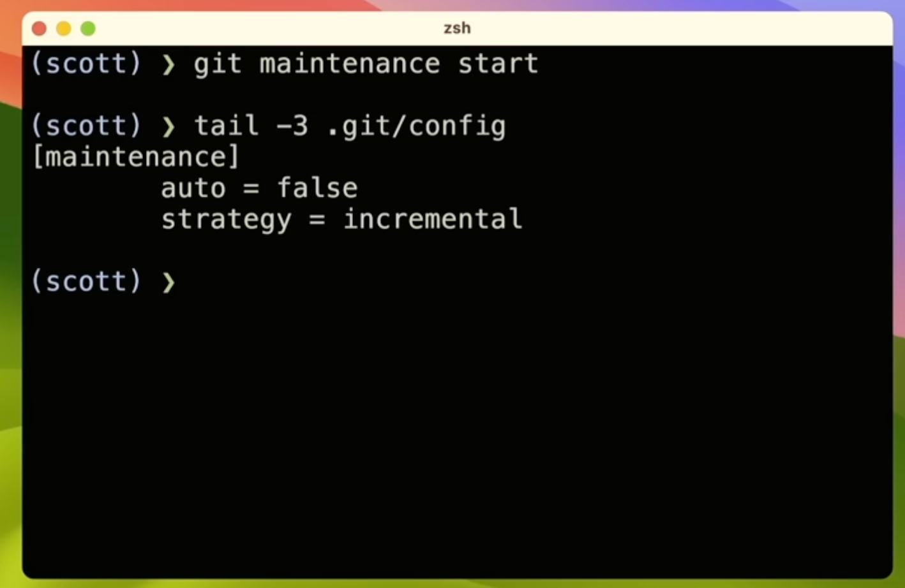
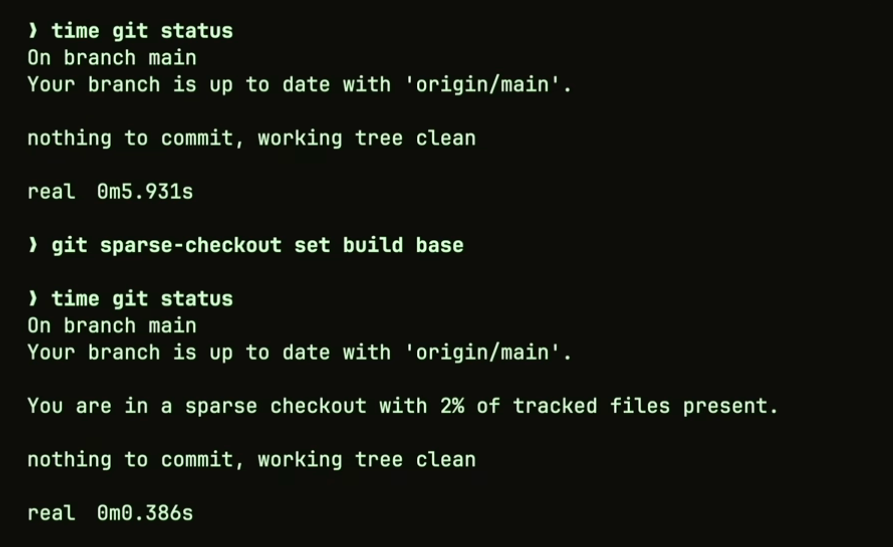

### Some Helpful Config Stuff

```
$ git config --global alias.staash 'stash --all'
```

```
https://gist.github.com/schacon
$ git config --global alias.bb !better-branch.sSh
```

```
Conditional Configs

[includeIf "gitdir:~/projects/work/"]
path = ~/projects/work/.gitconfig
[includeIf "gitdir:~/projects/oss/"]
path = ~/projects/oss/.gitconfig
```

### Oldier But Goodies

```
$ git blame -L
  just blame a "L"ittle
```

```
git log -L 15,26:path/to/file
```

```
$ git blame -W
  ignore whitespace

$ git blame -w -C
  ignore whitespace
  and detect lines moved or copied in the same commit
```

```
$ git log -S
  the "pickaxe"

git log -S files_watcher -p
```

```
git diff --word-diff
```

```
$ git config --global rerere.enabled true
  REuse REcorded REsolution
```

### Some New Stuff You May Not Have Noticed

```
$ git branch --column

git config --global column.ui auto
git config --global branch.sort -committerdatce
```

```
$ git push --force-with-lease
```



```
signing commits with ssh

$ git config gpg.format ssh

$ git config user.signingkey ~/.ssh/key.pub

$ git cat-file -p HEAD
```

```
$ git push --signed
```

```
$ git maintainance start

```


```
gc:                 disabled
commit-graph:       hourly
prefetch:           hourly
loose-objects:      daily
incremental-repack: daily
pack-refs:          none
```

### Big Repo Stuff

```
Windows
- approximately 3.5M files that results in a Git repo of about 300 gigabytes in size.
- with 4,000 engineers producing 1,760 daily "lab builds" across 440 branches, plus thousands of pull request validation builds.
```

```
Windows
* VFS for Git
* Scalar
* Git
```

```
prefetching
```

```
commit-graph
$ git config --global fetch.writeCommitGraph true

linux, 1.2M commits
(scott) > time git log --graph --oneline -10 > /dev/null // 9.89s
and time git commit-graph write
time git log --graph --oneline -10 > /dev/null // 0.01s
```

```
filesystem monitor
$ git config core.untrackedcache true
$ git config core.fsmonitor true

time git status
chromium, 470k files
```

```
partial cloning

$ git clone https://github.com/torvalds/linux.git
> git clone --filter=blob:none
> git clone --filter=tree:0
```

```
multipack indexes and
reachability bitmaps and
geometric repacking
```

### Monorepo Stuff

```
sparse-checkouts
```


### GitHub Stuff

```
allowed merge types
```

```
auto merge
```


